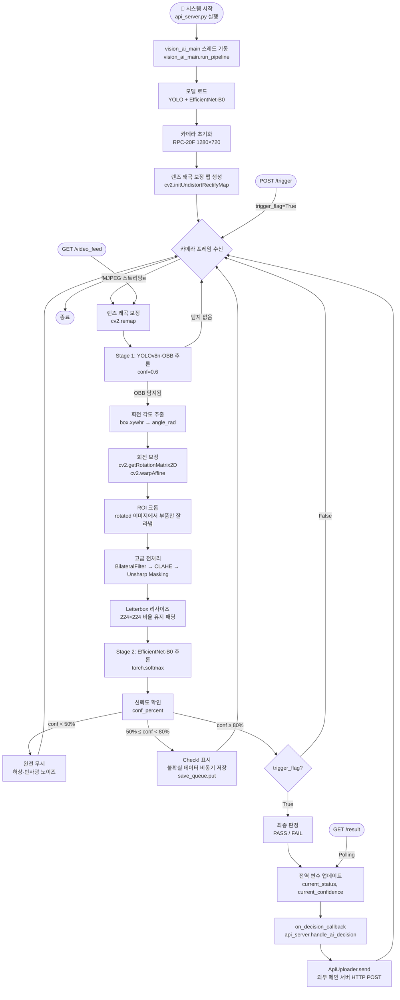

# 🎯 Two-Stage Vision AI Pipeline — 드론 부품 표면 결함 검출 시스템

> **YOLOv8n-OBB + EfficientNet-B0 두 모델의 역할 분리로 구현한 고정밀 실시간 품질 검사 시스템**


---

## 📋 목차

1. [아키텍처 개요 및 설계 철학](#1-아키텍처-개요-및-설계-철학)
2. [전체 Flow Chart](#2-전체-flow-chart)
3. [파일 목록 및 역할표](#3-파일-목록-및-역할표)
4. [Stage 1 — YOLOv8n-OBB 탐지 파이프라인](#4-stage-1--yolov8n-obb-탐지-파이프라인)
5. [데이터 연결부 — 크롭 및 전처리 흐름](#5-데이터-연결부--크롭-및-전처리-흐름)
6. [Stage 2 — EfficientNet-B0 정밀 분류](#6-stage-2--efficientnet-b0-정밀-분류)
7. [파일 간 연결 구조](#7-파일-간-연결-구조)
8. [통신 아키텍처](#8-통신-아키텍처)
9. [2단 정확도 필터](#9-2단-정확도-필터)
10. [Active Learning 자동 데이터 수집](#10-active-learning-자동-데이터-수집)
11. [Quick Start — 실행 방법](#11-quick-start--실행-방법)
12. [시스템 요구사항 및 의존성](#12-시스템-요구사항-및-의존성)

---

## 1. 아키텍처 개요 및 설계 철학

### 왜 Two-Stage (두 단계 분리) 인가

**"하나의 모델이 모든 것을 잘 할 수 없다"** — 이것이 핵심 설계 원칙입니다.

드론 부품 결함 검출에는 두 가지 근본적으로 다른 문제가 존재합니다:

| 문제 | 필요한 역량 | 최적 모델 |
|------|------------|-----------|
| "부품이 어디 있고, 몇 도 기울었는가?" | 공간 탐지 + 각도 추정 | YOLOv8n-OBB |
| "이 부품은 정상인가, 결함인가?" | 미세 질감 분류 | EfficientNet-B0 |

단일 YOLO 모델로 두 문제를 동시에 해결하려 했던 `failed_attempts/`의 실험들은  
탐지와 분류의 최적화 방향이 서로 다르다는 것을 실증적으로 보여줬습니다.  
Two-Stage 구조는 **각 모델이 자신이 잘 하는 일에만 집중**하게 함으로써 전체 정확도를 극대화합니다.

### 전체 시스템 개요

```
RPC-20F 카메라 (1280×720)
    ↓ [렌즈 왜곡 보정 — Intrinsic Calibration]
Stage 1: YOLOv8n-OBB
    ↓ [OBB 탐지 → 회전 보정 → ROI 크롭]
[고급 전처리: BilateralFilter → CLAHE → Unsharp Masking]
    ↓ [Letterbox 224×224]
Stage 2: EfficientNet-B0
    ↓ [4클래스 분류: Defect / Normal_C4 / Normal_Comm / Normal_Supply]
2단 정확도 필터 (50% / 80%)
    ↓
PASS / FAIL / Check! 판정
    ↓ [비동기 Active Learning 수집]
FastAPI 서버 (port 8001) → PLC / 외부 서버 / 웹 대시보드
```

---

## 2. 전체 Flow Chart

> Flow Chart 원본 이미지: [`Flow Chart-Vision AI.png`](Flow%20Chart-Vision%20AI.png)



---

## 3. 파일 목록 및 역할표

파이프라인 실행 순서에 따라 정렬되어 있습니다.

### 📁 Stage 0 — 환경 준비 및 OBB 시드 학습

| 파일명 | 역할 | 핵심 기술 |
|--------|------|-----------|
| `Hardware_Tuning_Step1.py` | RPC-20F 카메라 하드웨어 파라미터 최적화 (노출, 게인, 화이트밸런스) | `cv2.CAP_PROP_*`, 카메라 ISP 튜닝 |
| `train_seed_obb.py` | YOLOv8n-OBB 시드 모델 초기 학습 (epoch 50) | `YOLO('yolov8n-obb.pt')`, `model.train()` |
| `TXT_Change.py` | YOLO OBB 라벨 포맷 변환 유틸리티 | 라벨 포맷 브릿지, `.txt` 파싱 |

### 📁 Stage 1 — OBB 데이터 구축 및 파인튜닝

| 파일명 | 역할 | 핵심 기술 |
|--------|------|-----------|
| `OBB_Data_Crop.py` | OBB 탐지 결과 기반 ROI 크롭 + 배경 제거 + 레터박스 | `cv2.getPerspectiveTransform`, `rembg` |
| `auto_labeling.py` | OBB 크롭 결과물 자동 라벨링 | 자동 라벨 생성, 데이터셋 자동화 |
| `train_final_obb.py` | OBB 모델 최종 파인튜닝 (epoch 100) | `YOLO.train()`, Transfer Learning |

### 📁 Stage 2 — EfficientNet 데이터 구축 및 학습

| 파일명 | 역할 | 핵심 기술 |
|--------|------|-----------|
| `Defect-Image-Extract.py` | 결함 이미지 추출 및 분류 정리 | 결함 클래스 데이터 구축 |
| `Nomarl-Image-Extract.py` | 정상 이미지 추출 및 분류 정리 | 정상 클래스 3종 데이터 구축 |
| `Data_Crop_EFF.py` | EfficientNet 입력 규격(224×224) 크롭 변환 | Letterbox 전처리, 비율 유지 리사이즈 |
| `generate_preprocessed_crops.py` | 전처리 크롭 배치 생성 (고급 전처리 적용) | BilateralFilter, CLAHE, Unsharp Masking |
| `balance_dataset.py` | 클래스 불균형 해소 — 7가지 증강 기법 | 플립, 밝기, 이동, 대비, 노이즈, 회전 |
| `EfficientNet_Data_Spilt.py` | Train / Val / Test 데이터셋 분할 | `train_test_split`, 비율 유지 분할 |
| `EfficientNet Transfer Learning.py` | EfficientNet-B0 전이학습 파인튜닝 | `efficientnet_b0`, 4클래스 헤드 교체 |

### 📁 Stage 3 — 데이터 관리

| 파일명 | 역할 | 핵심 기술 |
|--------|------|-----------|
| `convert_to_json.py` | 결과 및 라벨 데이터 JSON 직렬화 | `json.dumps()`, 포맷 변환 |

### 📁 런타임 — 추론 엔진 및 통신

| 파일명 | 역할 | 핵심 기술 |
|--------|------|-----------|
| `vision_ai_main.py` | 메인 추론 엔진 — 카메라 루프 + 양 Stage 실행 | YOLO+EfficientNet 통합, threading, queue |
| `api_server.py` | FastAPI 통신 서버 — 진입점(Entry Point) | FastAPI, uvicorn, asyncio, MJPEG |

---

## 4. Stage 1 — YOLOv8n-OBB 탐지 파이프라인

### OBB가 일반 BBox 대비 회전 부품 검출에 유리한 이유

**일반 BBox (Axis-Aligned Bounding Box):**
```
┌─────────────────────┐
│  ╱‾‾‾‾‾‾‾╲         │  ← 회전된 부품 주변에 배경이 가득
│ ╱  부품    ╲        │     (배경 노이즈 혼입)
│ ╲          ╱        │
│  ╲________╱         │
└─────────────────────┘
```

**OBB (Oriented Bounding Box: 회전 각도를 포함한 경계 상자):**
```
    ╱‾‾‾‾‾‾‾╲
   ╱   부품   ╲        ← 부품 외곽에 딱 맞게 회전된 경계 상자
   ╲          ╱        (배경 노이즈 최소화)
    ╲________╱
```

드론 부품은 컨베이어 위에 임의의 각도로 놓입니다.  
OBB는 `(cx, cy, width, height, angle)` 5개 파라미터로 정의되어  
부품의 실제 형태에 맞게 경계 상자를 회전시킵니다.  
이로써 배경 노이즈 혼입이 최소화되고 EfficientNet이 받는 크롭 품질이 비약적으로 향상됩니다.

### train_seed_obb.py → Hardware_Tuning_Step1.py → OBB_Data_Crop.py → train_final_obb.py 흐름

**Step 1: 시드 학습 (`train_seed_obb.py`)**

```python
model = YOLO('yolov8n-obb.pt')
results = model.train(
    data=yaml_path,
    epochs=50,
    imgsz=640,
    batch=8,
)
```

초기에는 범용 사전학습 OBB 모델로 시드 학습을 시작해  
드론 부품 위치와 대략적인 회전 각도를 먼저 학습시켰습니다.  
이 단계의 목적은 최종 정확도 달성이 아니라 **크롭 가능한 수준의 안정적 OBB 검출기 확보**였습니다.

**Step 2: 하드웨어 튜닝 (`Hardware_Tuning_Step1.py`)**

카메라 입력 품질이 낮으면 아무리 좋은 모델도 흔들립니다.  
따라서 노출, 밝기, 포커스, 화이트밸런스와 같은 하드웨어 파라미터를 먼저 조정해  
OBB 학습에 들어가는 원천 데이터의 신호 대 잡음비(SNR)를 높였습니다.

**Step 3: OBB 기반 크롭 (`OBB_Data_Crop.py`)**

```python
cx, cy, w, h, angle = obb
M = cv2.getRotationMatrix2D((cx, cy), angle_deg, 1.0)
rotated = cv2.warpAffine(img, M, (img_w, img_h))
crop = rotated[y1:y2, x1:x2]
```

이 파일의 설계 의도는 단순 저장이 아니라 **Stage 2를 위한 고품질 입력 생산**입니다.  
즉 OBB는 끝이 아니라, EfficientNet이 잘 볼 수 있는 입력을 만들기 위한 전처리 도구입니다.

**Step 4: 최종 파인튜닝 (`train_final_obb.py`)**

초기 시드 모델과 크롭 파이프라인을 거친 후  
더 정제된 라벨과 하드웨어 튜닝된 입력으로 최종 파인튜닝을 수행합니다.  
이 단계에서 OBB 검출기는 단순 탐지기가 아니라 **회전 정렬 전처리 엔진**의 역할을 맡게 됩니다.

---

## 5. 데이터 연결부 — 크롭 및 전처리 흐름

### OBB 크롭 → EfficientNet 입력 데이터 변환 전 과정

```
원본 프레임
  ↓
YOLOv8n-OBB 탐지
  ↓
회전 각도 추출
  ↓
회전 보정 (deskew)
  ↓
ROI 크롭
  ↓
고급 전처리 (노이즈 완화 + 대비 향상 + 윤곽 강조)
  ↓
224×224 Letterbox 패딩
  ↓
EfficientNet 입력 텐서 변환
```

### 고급 전처리의 의도

`vision_ai_main.py`의 `apply_advanced_preprocessing()`은 V1 대비 개선 포인트가 매우 명확합니다.

```python
def apply_advanced_preprocessing(part_img):
    filtered = cv2.bilateralFilter(part_img, d=9,
                                   sigmaColor=50, sigmaSpace=75)
    lab = cv2.cvtColor(filtered, cv2.COLOR_BGR2LAB)
    l, a, b = cv2.split(lab)
    clahe = cv2.createCLAHE(clipLimit=2.0, tileGridSize=(8, 8))
    img_clahe = cv2.cvtColor(
        cv2.merge((clahe.apply(l), a, b)),
        cv2.COLOR_LAB2BGR)
    gaussian = cv2.GaussianBlur(img_clahe, (0, 0), 2.0)
    return cv2.addWeighted(img_clahe, 1.5, gaussian, -0.5, 0)
```

이 함수는 세 가지 목표를 동시에 달성합니다.
- `BilateralFilter`: 노이즈를 줄이되 경계선은 보존
- `CLAHE`: 어두운 표면 결함의 국소 대비 향상
- `Unsharp Masking`: 미세 스크래치, 얼룩, 표면 패턴 강조

즉 이 전처리는 "이미지를 예쁘게 만드는 과정"이 아니라  
**EfficientNet이 결함 특징을 더 안정적으로 읽게 만드는 특징 증폭 단계**입니다.

### balance_dataset.py — 클래스 불균형 해소 전략

`Defect` 클래스는 실제 현장에서 수집량이 적을 가능성이 높고,  
정상 클래스는 상대적으로 훨씬 많이 쌓입니다.  
`balance_dataset.py`는 이를 해결하기 위해 다음과 같은 증강 전략을 사용합니다.

| 전략 | 목적 |
|------|------|
| Horizontal / Vertical Flip | 방향 불변성 확보 |
| Brightness / Contrast 조절 | 조명 변화 일반화 |
| Shift / Translate | 위치 편차 일반화 |
| Rotation | 각도 편차 일반화 |
| Noise Injection | 센서 노이즈 내성 확보 |
| Blur / Sharpness 조절 | 초점 변화 대응 |
| Class Count Balancing | 클래스별 샘플 수 균형 |

핵심은 무작정 증강량을 늘리는 것이 아니라,  
**실제 카메라 환경에서 발생 가능한 변동만 선택적으로 반영**했다는 점입니다.  
이는 failed_attempts/의 3D 시뮬레이션 도메인 갭 경험이 반영된 설계입니다.

---

## 6. Stage 2 — EfficientNet-B0 정밀 분류

### 왜 EfficientNet-B0인가

EfficientNet-B0는 파라미터 수와 성능의 균형이 매우 좋습니다.  
실시간 시스템에서는 ResNet 계열보다 가볍고, MobileNet보다 미세 질감 분류에서 더 안정적인 경우가 많습니다.  
따라서 드론 부품 표면 결함이라는 **정밀하지만 빠른 분류** 요구에 적합한 선택입니다.

### EfficientNet Transfer Learning.py — 파인튜닝 전략

```python
classifier = models.efficientnet_b0(weights=None)
classifier.classifier = nn.Linear(
    classifier.classifier.in_features,
    len(CLASS_NAMES)
)
```

설계 포인트는 명확합니다.
- 백본은 EfficientNet-B0를 사용
- 최종 분류 헤드를 4클래스(`Defect`, `Normal_C4`, `Normal_Comm`, `Normal_Supply`)에 맞게 교체
- Stage 1에서 정렬된 고품질 크롭만 입력

이 접근은 "탐지와 분류를 한 모델에 억지로 넣는 대신,  
분류 전용 모델이 결함 패턴만 깊게 학습하도록 하자"는 철학을 구현합니다.

### letterbox_image()가 해결한 V1 찌그러뜨림 문제

V1에서는 단순 `cv2.resize(img, (224, 224))` 방식으로 입력을 강제로 압축했기 때문에  
길쭉한 부품이 찌그러지고, 표면 결함의 기하학적 비율이 변형되었습니다.  
`vision_ai_main.py`의 `letterbox_image()`는 이 문제를 해결한 핵심 개선입니다.

```python
def letterbox_image(img, target_size=224):
    h, w = img.shape[:2]
    scale = min(target_size / w, target_size / h)
    new_w = int(w * scale)
    new_h = int(h * scale)
    resized = cv2.resize(img, (new_w, new_h), interpolation=cv2.INTER_AREA)
    canvas = np.zeros((target_size, target_size, 3), dtype=np.uint8)
    x_off = (target_size - new_w) // 2
    y_off = (target_size - new_h) // 2
    canvas[y_off:y_off+new_h, x_off:x_off+new_w] = resized
    return canvas
```

이 함수의 핵심은 **비율 유지 리사이즈 + 검정 여백 패딩**입니다.  
즉 모델 입력 크기 제약은 맞추면서도 부품의 실제 형상 정보는 보존합니다.  
이는 표면 결함 분류 정확도 향상에 직접적으로 기여하는 V1 대비 개선 포인트입니다.

---

## 7. 파일 간 연결 구조

### api_server.py → import vision_ai_main 전역 변수 통신 방식

`api_server.py`는 별도의 IPC(Inter-Process Communication)나 Redis 없이,  
`import vision_ai_main`으로 동일 프로세스 내 전역 변수에 직접 접근합니다.

```python
import vision_ai_main

vision_ai_main.trigger_flag = True
status = vision_ai_main.current_status
confidence = vision_ai_main.current_confidence
```

이 방식의 장점은 구조가 단순하고 지연이 거의 없다는 점입니다.  
부트캠프 프로젝트 수준에서 빠르게 실시간 시스템을 완성해야 할 때  
과도한 분산 아키텍처 대신 **단일 프로세스 + 멀티스레드 + 공유 상태**를 택한 것은 현실적인 판단입니다.

### api_server.py 실행 시 vision_ai_main이 별도 스레드로 기동되는 구조

```python
if __name__ == '__main__':
    vision_thread = threading.Thread(
        target=vision_ai_main.run_pipeline,
        kwargs={"cam_index": 0,
                "on_decision_callback": handle_ai_decision})
    vision_thread.daemon = True
    vision_thread.start()
    uvicorn.run(app, host="0.0.0.0", port=8001)
```

여기서 설계 의도는 명확합니다.
- `uvicorn.run(...)`: API 서버 메인 루프 담당
- `vision_ai_main.run_pipeline(...)`: 카메라 캡처 + 추론 루프 담당
- 두 루프를 분리해 서로의 응답성을 해치지 않음

즉 `api_server.py`는 단순 웹 서버가 아니라  
**시스템 전체의 오케스트레이터(Orchestrator)** 역할을 수행합니다.

---

## 8. 통신 아키텍처

### /trigger — Non-blocking 트리거

V1에서는 `/trigger` 요청이 들어오면 서버가 while 루프에서 최대 10초 대기하며  
AI 판정이 끝날 때까지 응답을 잡고 있었습니다. 이 구조는 서버 타임아웃의 원인이었습니다.  
현재 버전은 즉시 `trigger_flag = True`만 설정하고 바로 반환합니다.

```python
@app.post("/trigger")
def trigger_vision(body: dict = Body(default={})):
    vision_ai_main.trigger_flag = True
    return {"message": "촬영 신호 수신 완료"}
```

이 설계는 PLC나 상위 제어 시스템에 매우 중요합니다.  
제어 신호 송신자는 "요청이 접수되었는가"만 빠르게 확인하면 되고,  
실제 판정 결과는 별도 API에서 읽어가면 되기 때문입니다.

### /result — Polling 기반 결과 조회

`GET /result`는 현재 상태(`current_status`, `current_confidence`, `current_part_name`, `current_order_id`)를 반환합니다.  
PLC가 0.5초 간격으로 폴링(Polling: 주기적으로 상태를 조회하는 방식)하면  
추론 완료 시점을 안정적으로 감지할 수 있습니다.

### /video_feed — async MJPEG 스트리밍

```python
@app.get('/video_feed')
async def video_feed():
    async def generate():
        while vision_ai_main.is_running:
            with vision_ai_main.lock:
                if vision_ai_main.global_frame is not None:
                    current_frame = vision_ai_main.global_frame.copy()
            ret, jpeg = cv2.imencode('.jpg', current_frame)
            yield (b'--frame\r\nContent-Type: image/jpeg\r\n\r\n'
                   + jpeg.tobytes() + b'\r\n')
            await asyncio.sleep(0.05)
```

이 구현은 `asyncio.sleep(0.05)`를 사용해 이벤트 루프를 막지 않으면서  
MJPEG 스트림을 계속 흘려보냅니다. 웹 대시보드 `/monitor`에서  
실시간 화면과 판정 결과를 동시에 볼 수 있게 하는 핵심 기능입니다.

### ApiUploader 클래스 비동기 HTTP 전송 구조

context상 `api_server.py`는 `handle_ai_decision()`을 통해  
`ApiUploader.send`로 외부 메인 서버에 HTTP POST를 수행합니다.  
이때 중요한 설계 포인트는 **추론 루프와 업로드 루프를 분리**했다는 점입니다.  
즉 현장 추론은 계속 진행하면서 결과 전송은 콜백/비동기 구조로 밀어내는 방식입니다.

---

## 9. 2단 정확도 필터

`vision_ai_main.py`에는 다음과 같은 임계값이 정의되어 있습니다.

```python
MIN_PASS_ACCURACY = 80.0
IGNORE_ACCURACY = 50.0
```

이 단순해 보이는 두 숫자는 실제로 매우 실용적인 운영 철학을 담고 있습니다.

| 구간 | 의미 | 시스템 반응 |
|------|------|-------------|
| `conf < 50%` | 허상, 반사광, 배경 노이즈 가능성 높음 | 완전 무시 |
| `50% ≤ conf < 80%` | 분류는 했지만 확신 부족 | `Check!` 표시 + 저장 |
| `conf ≥ 80%` | 운영 판정 가능 수준 | PASS / FAIL 최종 판정 |

이 방식은 "모든 입력에 억지 판정을 내리지 않는다"는 점에서 중요합니다.  
특히 산업 현장에서는 잘못된 자동 판정(False Accept / False Reject)이  
검사 누락보다 더 큰 비용을 낳을 수 있기 때문입니다.

---

## 10. Active Learning 자동 데이터 수집

### background_image_saver 구조

```python
save_queue = queue.Queue()

def background_image_saver():
    while True:
        filepath, img_data = save_queue.get()
        cv2.imwrite(filepath, img_data)
        save_queue.task_done()

threading.Thread(target=background_image_saver, daemon=True).start()
```

이 구조는 산업용 시스템에서 매우 실용적입니다.  
실시간 추론 루프에서 `cv2.imwrite()`를 직접 호출하면 디스크 I/O 때문에 프레임이 끊길 수 있으므로,  
저장 작업을 백그라운드 스레드로 밀어내 비동기 처리합니다.

### 왜 Active Learning인가

`50% ≤ conf < 80%` 구간의 이미지는 모델이 애매해하는 사례입니다.  
이 데이터를 자동 저장하면 다음 학습 사이클에서 "모델이 약한 구간"만 다시 보강할 수 있습니다.  
즉 이 시스템은 추론기이면서 동시에 **다음 버전 데이터를 스스로 모으는 학습 보조 시스템**이기도 합니다.

---

## 11. Quick Start — 실행 방법

### 1) 환경 준비

```bash
python --version
# Python 3.11.9 권장

pip install -r requirements.txt
```

### 2) 모델 가중치 준비

다음 두 가중치 파일이 올바른 경로에 있어야 합니다.
- YOLOv8n-OBB 가중치 파일
- EfficientNet-B0 분류 가중치 파일

예시:
```text
models/
├── best_obb.pt
└── efficientnet_b0_best.pth
```

### 3) 서버 실행

```bash
python api_server.py
```

실행 시 내부적으로 다음 순서가 동작합니다.
1. `api_server.py`가 FastAPI 서버를 초기화
2. `vision_ai_main.run_pipeline()`를 별도 스레드로 기동
3. 카메라 초기화 및 모델 로드
4. `/monitor`, `/video_feed`, `/trigger`, `/result` 엔드포인트 활성화

### 4) API 사용 예시

```bash
curl -X POST http://127.0.0.1:8001/trigger
curl http://127.0.0.1:8001/result
```

브라우저 모니터링:
```text
http://127.0.0.1:8001/monitor
```

---

## 12. 시스템 요구사항 및 의존성

### 하드웨어 요구사항

| 항목 | 권장 사양 |
|------|-----------|
| Camera | RPC-20F (1280×720) |
| CPU | 멀티스레드 처리 가능한 x86/ARM CPU |
| GPU | CUDA 지원 GPU 권장 (학습 시 필수, 추론 시 권장) |
| Storage | 이미지 로그 및 Active Learning 저장용 SSD 권장 |
| Network | PLC / 외부 서버 연동 가능한 LAN 환경 |

### 소프트웨어 요구사항

| 항목 | 버전 |
|------|------|
| Python | 3.11.9 Global |
| PyTorch | CUDA 호환 버전 권장 |
| Ultralytics | YOLOv8-OBB 지원 버전 |
| OpenCV | 4.x |
| FastAPI | 0.100+ |
| Uvicorn | 최신 안정 버전 |
| torchvision | EfficientNet-B0 지원 버전 |

### 주요 라이브러리

```python
import cv2
import torch
import torchvision.models as models
import torch.nn as nn
import numpy as np
import threading
import queue
import math
from ultralytics import YOLO
from fastapi import FastAPI, Body
from fastapi.responses import StreamingResponse
import asyncio
import uvicorn
```

---

## 마무리

`two_stage_pipeline/`은 단순히 모델 두 개를 직렬로 붙인 폴더가 아닙니다.  
이 구조는 `failed_attempts/`에서 축적된 문제 인식, 하드웨어 이해, 통신 병목 분석, 전처리 개선 경험이  
하나의 실전형 아키텍처로 정리된 결과물입니다.  
즉 이 폴더는 "정확도 향상"만이 아니라 **산업 현장에서 실제로 돌아가는 시스템을 설계하는 역량**을 보여주는 핵심 포트폴리오입니다.
